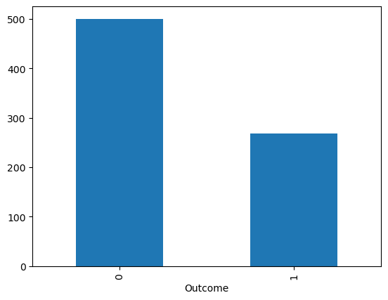
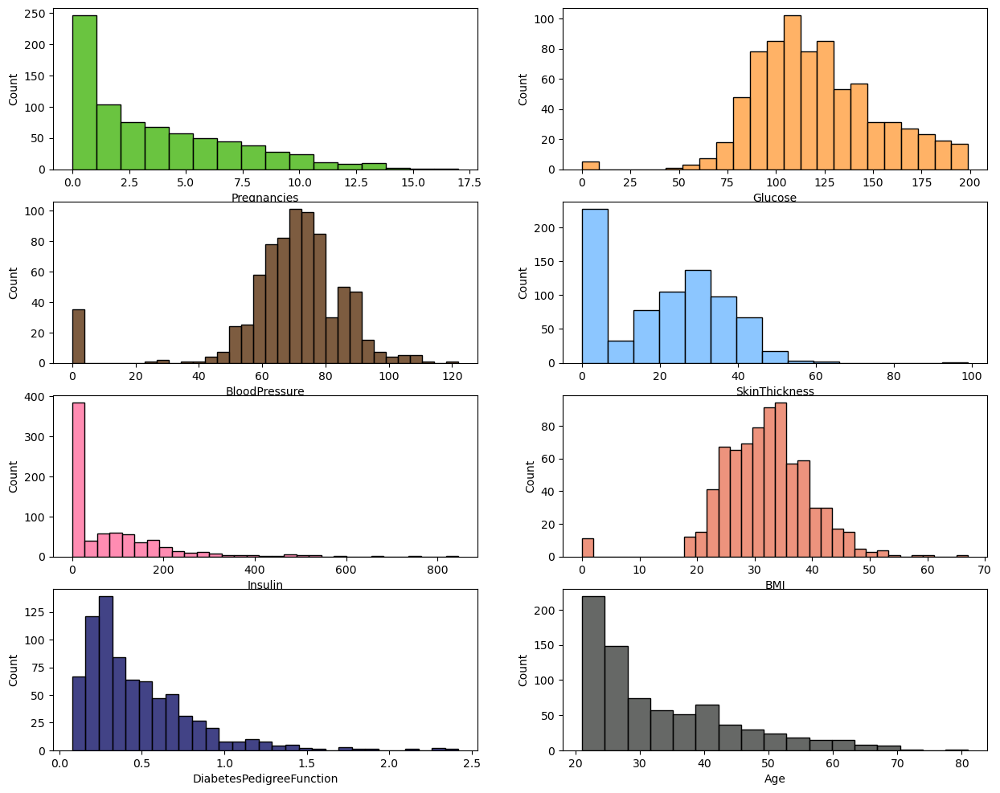
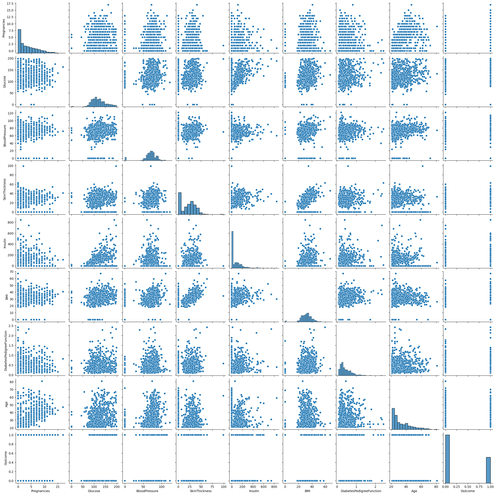
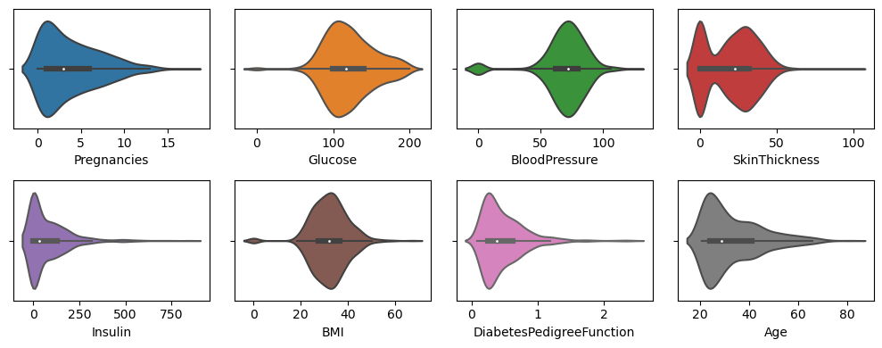
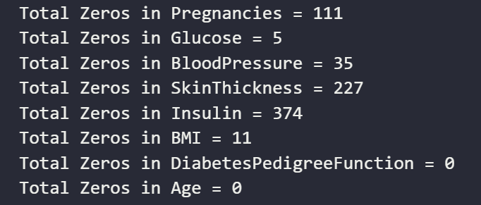
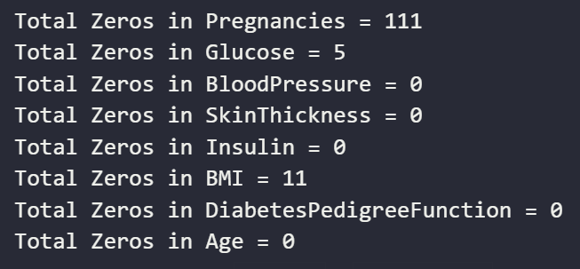
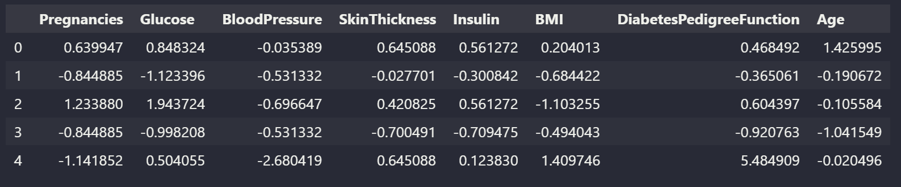
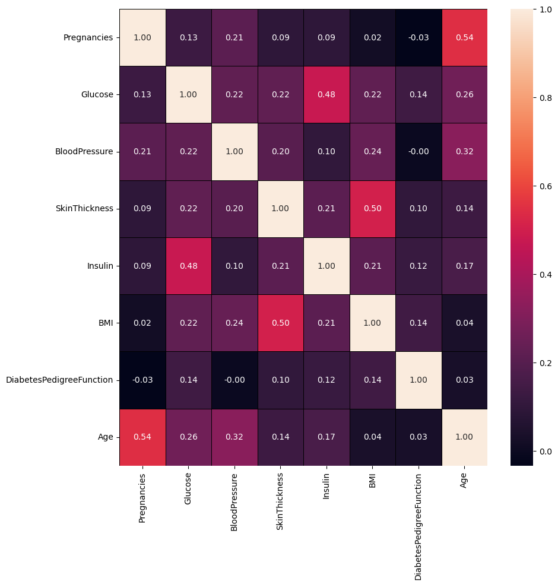
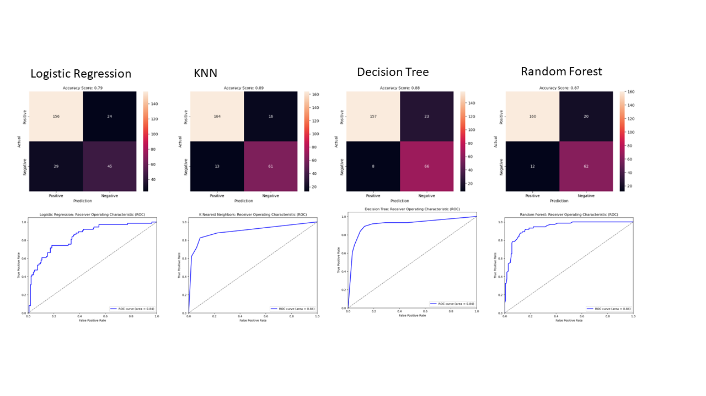
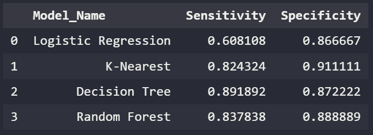

## Project Outcomes

In this Project, we are going to perform a full supervised learning machine learning project on a "Diabetes" dataset. This dataset is originally from the National Institute of Diabetes and Digestive and Kidney Diseases. The objective of the dataset is to diagnostically predict whether a patient has diabetes, based on certain diagnostic measurements included in the dataset.

[Kaggle Dataset](https://www.kaggle.com/datasets/akshaydattatraykhare/diabetes-dataset)

## Exploratory Data Analysis

For this task, you are required to conduct an exploratory data analysis on the diabetes dataset. You have the freedom to choose the visualizations you want to use, but your analysis should cover the following tasks mostly:

- Are there any missing values in the dataset?
- How are the predictor variables related to the outcome variable?
- What is the correlation between the predictor variables?
- What is the distribution of each predictor variable?
- Are there any outliers in the predictor variables?
- How are the predictor variables related to each other?
- Is there any interaction effect between the predictor variables?
- What is the average age of the individuals in the dataset?
- What is the average glucose level for individuals with diabetes and without diabetes?
- What is the average BMI for individuals with diabetes and without diabetes?
- How does the distribution of the predictor variables differ for individuals with diabetes and without diabetes?
- Are there any differences in the predictor variables between males and females (if gender information is available)?

## Step 1 - Description

1. What type of fields?
2. How large is dataset?
3. How many categorical values (that will need encode or 1-hot)
4. Prevalence on Nulls?  
   
**Observations 1:**

* There are 9 fields in total (8 features, 1 target)
* 768 Records in total
* Do not appear to be any Nulls
* No categorical fields
* 3 calculated fields: BMI, Pedigree Function and Age.
* Age will likey need to be 'binned'  
  
>
> 35% of people in data set had Diabetes

### Step 2 - Visualization 
* Create visualization of the 8 features
* Qualitatively identify outliers and or grouping

**Tools**:  
1) Histogram
   
2) Pairplot [ref: Medium](https://webcache.googleusercontent.com/search?q=cache:https://medium.com/analytics-vidhya/pairplot-visualization-16325cd725e6)  
     
3) Boxplots  
   
4) Violin plot  
   

## Preprocessing and Feature Engineering
In part I, several observations were made regarding data quality. The following tasks will be considered and taken as required.  
- Handling missing values
- Handling outliers
- Scaling and normalization
- Feature Engineering
- Handling imbalanced data

### Missing Values or Zero Values

* Confirm the counts for zero values
* Identify and Exclude nonrelevant features from further pre-processing
* Features included in additional pre-processing are: 
  * insuling
  * glucose
  * blood pressure
  * skin thickness
  * BMI
  * DPF
* Approach to fill 0 will be to insert the mean of from the disease state. 
  * Example : glucose = 0 for non-disease state will be populated with avg.glucsose from the non-disease state.

>Before Remediating ZEROS  

> After Remediation  

### Outliers

* Primary outliers in this data set were the zero-value entries. 
* These have been addressed in the preceeding section. 
* The remaining outliers did not appear material in size and will remain. 
* The outliers will be reviewed depending on the model, and tuning paramters

### Scaling and Normalization  

### Correlation Heatmap

## Machine Learning
- Split the data between training and test.
- Train the models: Train the selected models on the training set.
- Model evaluation: Evaluate the trained models on the testing set using appropriate evaluation metrics
- Model comparison: Compare the performance of the selected models and choose the best-performing model based on the evaluation metrics. 
- Additional analysis, such as model tuning and cross-validation, to improve the model's performance.

## Model Summary and Library import

Models used in the unsupervised classification include: 
* Logistic Regression
* K-Nearest Neighbors
* Decision Tree
* Randon Forest

The metrics used to evaluate the effectiveness of each model include: 
* Accuracy Score
* Sensitivity
* Precision
* F1
* ROC
* AUG

### Data Frame for the Evaluation measures

* We will be creating a number of metrics through the various models. 
* Create a dataframe (ie table) to maintain all these measures. 
* Update the table with the measures automatically when evaluation is completed.  
   
  

  
## Conclusion
Four machine learning models were developed following exploratory data analysis (EDA). The specificity and sensitivity of these models is provided below. The following conclusions can be made about the findings: 

1. None of the models in their current configuration offer satisfactory results for sensitivity (too many missed positives) or specificity (too many false positivies) to be considered a 'diagnostic' predictor.
2. Additional optimization efforts, such as Grid search, need to be undertaken to optimize the models to increase accuracy.
3. KNN appears to be the best model where the implications of False Positive are of great concern. (Example might be misdiagnosis of cancer)
4. Decision tree appear to be the most appropriate model in circumstances where the risk of a False Negative (ie missed Postive) is the greatest. Such an example might be in the case of a high-risk communicable disease, such as Covid. 
5. Given that Type 2 Diabetes is a preventable condition, with non-invasive interventions all of which improve overall health (ie diet and exercise), these models could be used to help inform clinicians and in turn patients of their risk factors and liklihood to acquire the disease. 